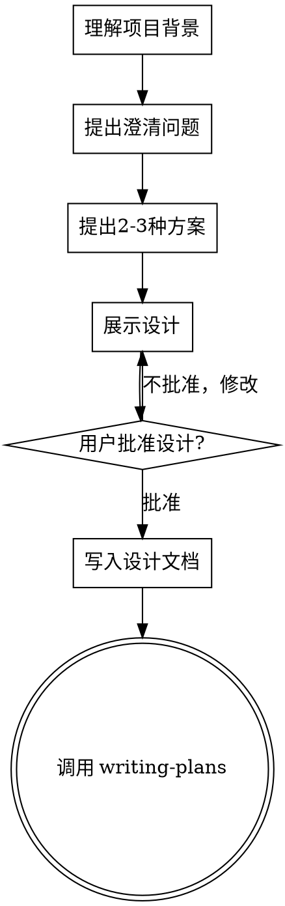

# Brainstorm - 头脑风暴

## 概述

在任何创造性工作之前使用——创建功能、解决问题、探索新方向。通过提问理解用户真正想要什么，展示设计并获得批准后再开始实施。

## 核心原则

**硬性门槛**：在展示设计并获得用户批准之前，**不要**调用任何实施技能、编写代码、或执行任何实施行动。

## 反模式："这太简单不需要设计"

每个项目都要经历这个过程。即使是待办事项列表、单功能工具、配置更改——都需要。"简单"项目恰恰是未经验证的假设造成最大浪费的地方。设计可以是简短的（对于真正简单的项目只需几句话），但必须展示并获得批准。

## 工作流程

## 完整流程

### 第一步：理解项目背景

- 先了解当前项目状态（文件、文档、最近的提交）
- 一次只问一个问题来细化想法
- 优先用选择题，开放式也可以
- 聚焦于理解：目的、约束、成功标准

### 第二步：提出澄清问题

一次只问一个问题。如果一个主题需要更多探索，拆分成多个问题。

示例问题：
- "你希望通过这个功能解决什么问题？"
- "目标用户是谁？"
- "有什么预算或时间限制？"
- "怎么算成功？"
- "有什么不能接受的方案？"

### 第三步：提出2-3种方案

用对话的方式展示选项，说明你的推荐和理由。先推荐你的选项再解释为什么。

### 第四步：展示设计

一旦理解了在做什么，就展示设计。根据复杂性调整每部分的长度：简单的几句话，复杂的200-300字。在每个部分后问"这样对吗"。

设计应涵盖：
- 整体架构
- 核心组件
- 数据流
- 错误处理
- 如何验证成功

### 第五步：写入设计文档

将验证后的设计写入 `docs/plans/YYYY-MM-DD-<主题>-design.md` 并提交到 git。

### 第六步：过渡到实施

调用 `writing-plans` 技能创建实施计划。

## 关键原则

- **一次只问一个问题** - 不要一次问很多
- **优先选择题** - 比开放式更容易回答
- **YAGNI 原则** - 从所有设计中移除不必要的功能
- **探索替代方案** - 在确定之前总是提出2-3种方法
- **增量验证** - 展示设计，获得批准后再继续
- **保持灵活** - 有问题时回去澄清

## 与 Superpowers 对比

| Superpowers (Coding) | OpenClaw (通用) |
|---------------------|----------------|
| 检查代码文件 | 检查现有 Skills/配置 |
| 代码设计 | 场景设计/流程设计 |
| 实施计划 | 实施计划/任务拆分 |
| 开发者执行 | 子代理/自动化执行 |

