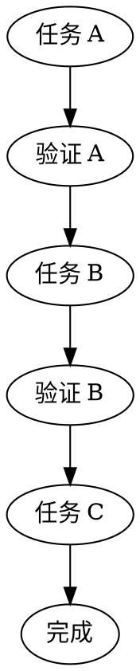
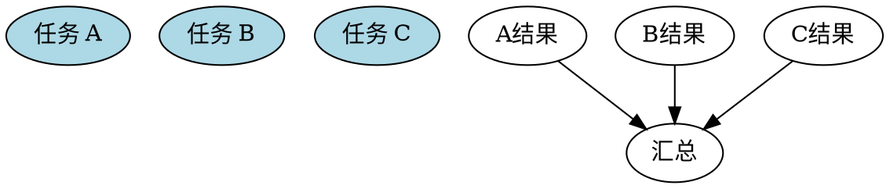

# Workflow Runner - 工作流执行

## 概述

当你有一个多步骤计划，需要串行或并行执行任务时使用。

## 核心原则

**串行执行**：任务 B 依赖任务 A 的结果，按顺序执行。
**并行执行**：任务之间独立，同时执行。
**子代理执行**：将任务分配给子代理执行，收集结果。

## 执行模式

### 模式一：串行执行



适用场景：任务有依赖关系，必须按顺序执行

### 模式二：并行执行



适用场景：任务完全独立，可以同时执行

### 模式三：子代理执行

```
1. 将任务分配给子代理
2. 子代理执行任务
3. 收集结果
4. 验证结果
5. 继续下一个任务或汇总
```

适用场景：复杂任务，需要子代理的处理能力

## 执行流程

### 1. 解析计划

读取计划文件，提取所有任务及其上下文。

### 2. 分析依赖

对于每个任务，确定：
- 依赖哪些任务
- 被哪些任务依赖
- 是否可以并行

### 3. 执行任务

根据依赖关系选择执行模式：

**如果任务有依赖** → 串行执行
```bash
# 先执行依赖任务
execute_task "任务A"
# 验证结果
verify_result "任务A"
# 执行当前任务
execute_task "任务B"
```

**如果任务独立** → 并行执行
```bash
# 同时执行多个独立任务
execute_task "任务A" &
execute_task "任务B" &
execute_task "任务C" &
wait
# 汇总结果
aggregate_results
```

### 4. 验证结果

每个任务执行后验证：
- 执行是否成功
- 输出是否符合预期
- 是否有错误需要处理

### 5. 错误处理

- 如果任务失败，记录错误
- 可以选择：重试、跳过、终止
- 报告整体执行状态

## 使用示例

### 示例 1：串行执行

```
用户：帮我安装配置开发环境

我（使用 workflow-runner）：
1. 安装 Node.js
2. 安装依赖包
3. 配置环境变量
4. 验证安装成功

[执行任务 1: 安装 Node.js]
> brew install node
> 验证: node --version
> 结果: v20.10.0 ✅

[执行任务 2: 安装依赖包]
> npm install
> 验证: ls node_modules
> 结果: 已安装 ✅
...
```

### 示例 2：并行执行

```
用户：帮我搜索这几个主题的资料

我：
- 主题 A: AI 发展
- 主题 B: Python 技巧  
- 主题 C: OpenClaw 教程

[并行执行三个搜索任务]
- 子代理 1: 搜索 AI 发展
- 子代理 2: 搜索 Python 技巧
- 子代理 3: 搜索 OpenClaw 教程

[汇总结果]
生成综合报告
```

### 示例 3：复杂工作流

```
用户：帮我搭建一个博客系统

计划：
1. 创建项目结构
2. 配置数据库
3. 实现用户系统
4. 实现文章系统
5. 实现评论系统
6. 部署上线

[串行执行，因为有依赖]
- 1 -> 2 -> 3 -> 4 -> 5 -> 6
```

## 配置选项

### 超时设置

```yaml
timeout:
  per_task: 300  # 每个任务最多 5 分钟
  total: 3600    # 总共最多 1 小时
```

### 重试设置

```yaml
retry:
  max_attempts: 3      # 最多重试 3 次
  delay_seconds: 5     # 重试间隔 5 秒
```

### 通知设置

```yaml
notify:
  on_complete: true      # 完成时通知
  on_error: true        # 错误时通知
  channel: feishu        # 通知渠道
```

## 与 Superpowers 对比

| Superpowers | OpenClaw Workflow Runner |
|-------------|------------------------|
| 子代理驱动开发 | 串行/并行/子代理三种模式 |
| 代码质量审查 | 灵活的验证机制 |
| Git 工作树 | 任务状态追踪 |
| 代码审查 | 结果汇总报告 |

## 最佳实践

1. **先验证再继续** - 每个任务完成后验证结果
2. **记录执行日志** - 方便排查问题
3. **灵活的错误处理** - 根据错误类型决定重试或跳过
4. **进度可视化** - 让用户知道执行状态
5. **可中断** - 用户可以随时停止执行

