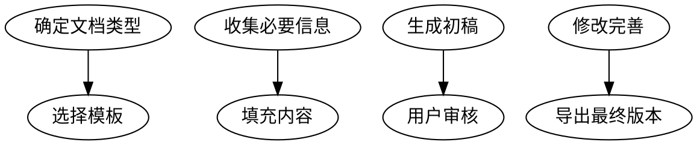

# Doc Writer - 文档生成

## 概述

当用户需要创建结构化文档（如报告、方案、计划、技术文档）时使用。

## 核心功能

- **模板化生成** - 基于预定义模板快速生成文档
- **结构化输出** - 清晰的大纲和格式
- **多格式导出** - 支持 Markdown、PDF、HTML 等格式

## 工作流程



## 支持的文档类型

### 1. 报告类

- 周报/月报
- 项目进度报告
- 数据分析报告
- 事故报告

### 2. 方案类

- 项目方案
- 产品方案
- 技术方案
- 解决方案

### 3. 计划类

- 学习计划
- 工作计划
- 旅行计划
- 项目计划

### 4. 文档类

- 技术文档
- API 文档
- 用户手册
- 操作指南

## 模板结构

```markdown
---
title: 文档标题
type: [报告|方案|计划|文档]
author: 作者
date: 日期
---

# 大纲

1. [第一章]
   - 1.1
   - 1.2
2. [第二章]
   - 2.1
   - 2.2

# 内容

## 第一章
...

## 第二章
...
```

## 使用示例

### 示例 1：生成周报

```
用户：帮我写一份本周工作周报

我：
1. 询问本周完成的工作
2. 询问遇到的问题
3. 询问下周计划

用户：
- 完成了用户登录功能
- 修复了三个 bug
- 下周开始开发订单模块

我（使用 doc-writer）：
- 选择"周报"模板
- 填充内容
- 生成文档
```

生成的周报：

```markdown
# 周报（2026年3月1日）

## 本周工作

### 已完成
- 用户登录功能开发
- 修复 3 个 bug

### 进行中
- 订单模块开发（进行中）

## 问题与挑战

无重大问题

## 下周计划

- 开始开发订单模块
- 完成订单列表页面
```

### 示例 2：生成项目方案

```
用户：帮我写一个电商系统项目方案

我：
1. 询问项目背景和目标
2. 询问预算和时间
3. 询问技术要求

用户：
- 目标是搭建一个小型电商网站
- 预算 5 万，时间 3 个月
- 使用 Python + Vue

我（使用 doc-writer）：
- 选择"项目方案"模板
- 填充内容
- 生成完整方案文档
```

## 输出格式

### Markdown

```markdown
# 文档标题

## 大纲
...

## 内容
...
```

### 飞书文档

```json
{
  "action": "feishu_doc.create",
  "title": "文档标题",
  "content": "markdown 内容"
}
```

### PDF

通过 HTML 转换或直接生成。

## 配置选项

### 模板目录

```yaml
template_dir: ~/.openclaw/templates/
```

### 自定义模板

用户可以创建自己的模板，存放在模板目录中。

### 样式设置

```yaml
style:
  font: "PingFang SC"
  size: 14
  line_height: 1.8
```

## 与 Superpowers 对比

| Superpowers | OpenClaw Doc Writer |
|-------------|-------------------|
| 代码文档 | 业务文档 |
| API 文档 | 报告/方案 |
| README | 各种结构化文档 |

## 最佳实践

1. **先收集信息** - 通过提问获取必要内容
2. **使用模板** - 保持文档结构一致
3. **用户审核** - 生成初稿让用户审核修改
4. **版本管理** - 保存文档版本历史
5. **多种格式** - 支持导出不同格式

